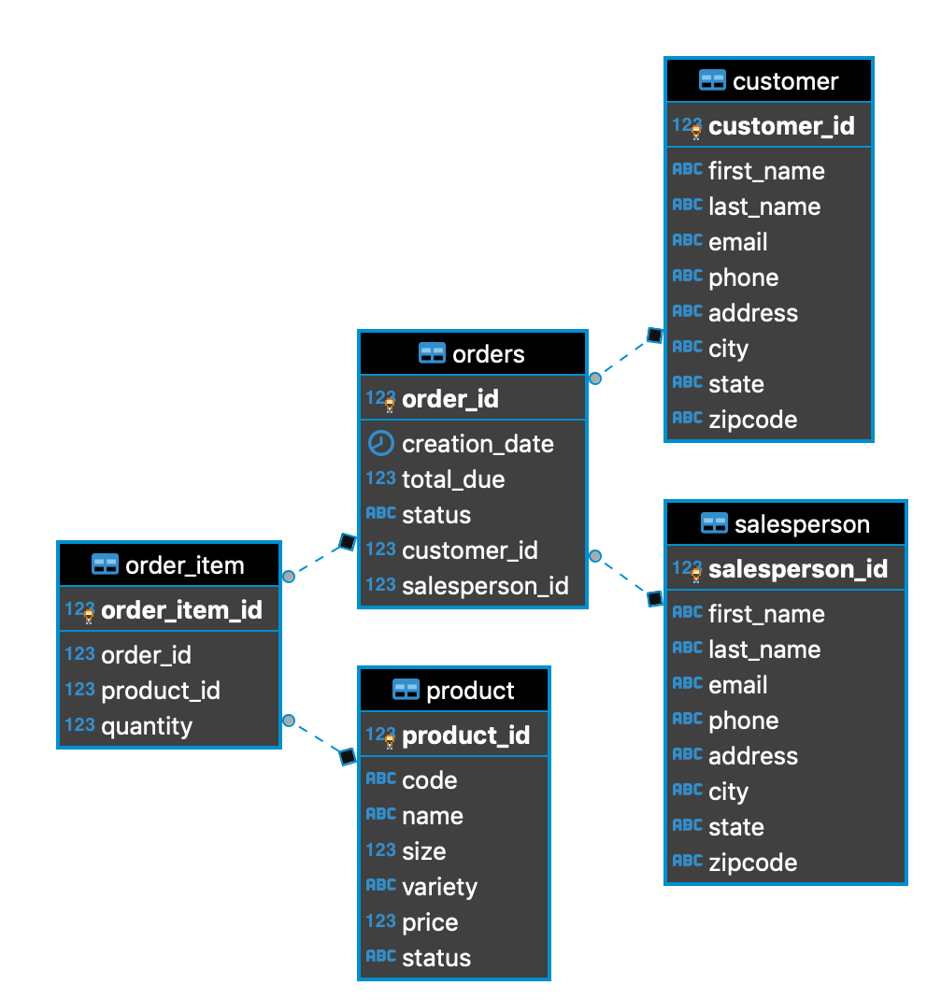

# Introduction
This project is done to learn about how JDBC works by working with Data Access Object (DAO).
The project is a working implementation of a DAO for orders; specifically, this project implements 
the OrderDAO class with an Order and OrderLine Data Transfer Objects so that 
the project can find orders based on orderID.

# ER Diagram

# Design Patterns

The Data Access Object is a class or interfaces that does Create, Read, Update, Delete (CRUD) to the
database. This object will either be one line in a database or the object could also represent the 
result of a query. The Data Transfer Object acts as a storage container to interact with the DAO 
where data is stored in the DTO and then DAO helps save it into the database. Additionally, when 
reading from the database, data is read into the DAO and a DTO is created so to store that data
and then the DTO is returned so to abstract the interaction between the database and the java 
backend.

The repository pattern is the idea of decoupling the database implementation and the 
actual queries to get the information, which is very similar to the DAO pattern.
The difference between DAO and the repository pattern is that the repository pattern focuses on 
queries into one table in the database and then if needed would join the information from that 
single table with other queries in the code. In practice, repository pattern scales better in 
distribution where DAO repositories require more vertical scaling.