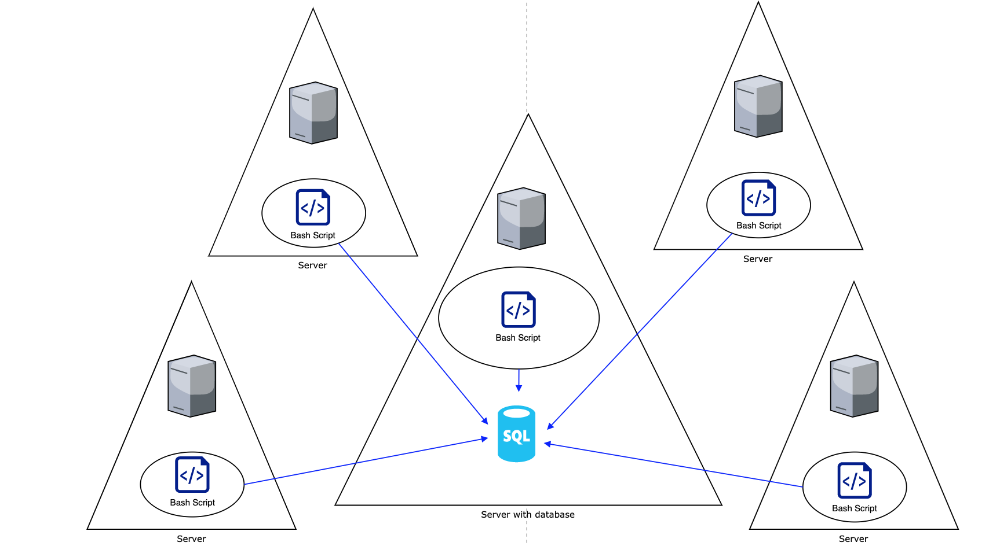

# Linux Cluster Monitoring Agent

## Introduction
  
The Linux Cluster Monitoring Agent is designed to help keep track of CPU usages on servers; the goal of this project is to have a monitoring agent scripts that keep a minute by minute update of the CPU statuses of all servers to be sent to a central Postgres sequel (PSQL) database for safekeeping. To do that, the monitoring agent has a docker PSQL container in one of the servers and collects the basic host information of all the other servers. Then, a script that is scheduled on a crontab to run every minute that will continuously send the systems' CPU information to the PSQL database.
  
## Architecture and Design

As shown above, the Linux Cluster Monitoring Agent will have bash scripts running on all servers. A crontab will schedule the scripts to submit a SQL request that collects the current host usage (CPU and Memory) to the PSQL database.

### PSQL database architecture
The PSQL database `host_data` will contain two tables.
The `host_info` table will record static information about the individual servers when the bash scripts are first installed.

The `host_usage` table will record the CPU usage data from the individual servers from the scheduled cron job.

`host_info` will record the following information
* `id` a unique self-incrementing id that will help keep track of the servers as well as serve as the primary key for the table
* `hostname` the fully qualified hostname of the server, assumed to be unique amongst the different servers.
* `cpu_number` the number of CPU cores that the machine has.
* `cpu_architecture` the CPU's architecture.
* `cpu_model` the model of the CPU.
* `cpu_mhz` measures the CPU speed
* `L2_cache` how much space (in kB) the L2 cache has.
* `total_memory` the total amount of memory (in kB) the CPU has.
* `timestamp` when was the information recorded, measured in UTC time.

`host_usage` table will record the following information
* `timestamp` will record the UTC time when the entry was sent to the DB.
* `host_id` will refrence the host id from `hosts_info` table to identify which computer sent the report.
* `memory_free` will record how much of the memory (in MB) is not in use.
* `cpu_idle` will record the percentage of CPU that is idle.
* `cpu_kernel` will record the percentage of the kernel is being spent idle.
* `disk_io` will record the current amount of disk I/O Operations.
* `disk_available` will record how much disk space (in MB) is available.


### Script Descriptions
`psql_docker.sh` is the bash file that will set up the environment so that everything is prepared. `psql_docker.sh` will ensure that the docker container is started, the volume created, as well as the PSQL container running so that the operations on the database can begin.

`ddl.sql` will initialize the PSQL database `host_data` in addition to creating the tables to store hardware specifications as well as usage data.

`scripts/host_info.sh` script will be run once to provide specifications about the server to the PSQL DB.

`scripts/host_usage.sh` is the automated script by crontab to run every minute to provide CPU usage data to the PSQL DB.

`sql/queries.sql` will provide the following SQL results: 
    1) Group hosts by CPU number and sort by their memory size in descending order(within each cpu_number group)
    2) Average used memory in percentage over 5 mins interval for each host

## Usage
**Pre-Requisite: the system requires docker to be provisioned**

### Initialize Database and Tables
```
# To begin inside of the current directory, start with calling

./psql_docker.sh start db_password

# This will set up the docker environment
# Then initialize the database and their tables

psql -h psql_host -p 5432 -U postgres -W -f ./sql/ddl.sql
```
### `host_info.sh` usage
`host_info.sh` tells the database information about the system so this script will only be run once. To do this
```
# from this directory
./scripts/host_info.sh psql_host psql_port db_name psql_user psql_password
```
### `host_usage.sh` usage
Normally, this script would be run automatically by a crontab.
However to manually run the script:
```
scripts/host_usage.sh psql_host psql_port db_name psql_user psql_password
```
### Crontab usage
Most of the time `host_usage.sh` will be run through crontab
```
# begin by opening your crontab jobs

crontab -e

#inside of the editor enter the following line and exit

* * * * * bash [path to this directory]/scripts/host_usage.sh localhost 5432 host_agent postgres password > /tmp/host_usage.log

# Verify that the edit was successful

crontab -ls

```

## Improvement
  1) Handle the machines have their specifications changed. This would mean being able to update specific lines in `host_info` to reflect the changes as well as providing some information about the previous specifications.
  
  2) Be able to alert the server administrators about when their system is about to run out of available disk space.
  
  3) Create a cron job to summarize the daily usage on each machine and upload it remotely so that if the database were lost there would still be reported. Additionally, it would allow the server administrators to be able to skim through the usage results to see if anything went wrong in the past day.
